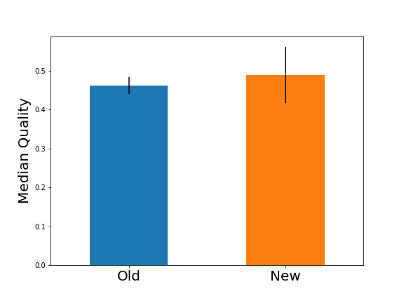

.. _`examples`:

Examples
========

A/B Testing
-----------

Your colleague John has developed a super-hot new feature for your companies website.
But of course before turning it on, your boss wants you to check its quality.
So you do some A/B-testing: a fraction of the users gets the new feature whereas most of the users still see
the old website.
The keep things simple: the users rate their experience with a single number between 0 and 1 afterwards.

Your boss has recently read a statistics book and now wants a different performance indicator than usual::

    Instead of using the mean, we will calculate the median this time
    as is is not so sensitive to outliers!

Your colleague John loads the data into his jupyter and quickly calculates the result:

.. code-block:: python

    >> df.groupby("group").quality.median()
    group
    A    0.462222
    B    0.487938
    Name: quality, dtype: float64

"Nice", John says. The new method (method B) is much better than the old one! Let use it from now on!
"Not so fast", you say, "how large is the statistical uncertainty on the result".
"Statistical what?", asks John.
"Well, your new method was only tested on a smaller sample.
It could be, that you are measuring just an upwards fluctuation.
Lets check it."
So you also load the data into your notebook and just do a small change:

.. code-block:: python

    >> from uncertain_panda import pandas as pd
    >> df.groupby("group").quality.unc.median()
    group
    A    0.462+/-0.021
    B      0.49+/-0.07
    Name: quality, dtype: object

"That was easy.", says John. "What are those additional numbers?"
"This is the statistical uncertainty on the result."
The smaller the sample size is, the less 'curtain' you can be on the result.
And in this case it seems that the statistics is too small to make a reasonable statement.
The two groups are compatible withing their uncertainties."
"Very good you pointed that out", says John. "But how to tell our boss?"
"I know he always likes figures", you respond.
So you continue in the notebook

.. code-block:: python

    >> plt.figure(figsize=(8, 6))
    >> df.groupby("group").quality.unc.median().\
            plot_with_uncertainty(kind="bar", ax=plt.gca())

"The error bars indicate the statistical uncertainty. You see, the new method seems better but with the high
uncertainty you can not give a statement."
"Nice", says John. "Let's show this to our boss!"

